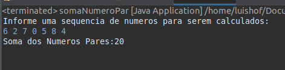
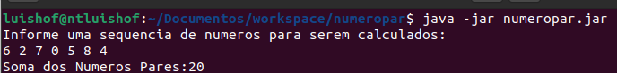

# Desafio de Lógica de Programação

Dados um número inteiro n, n > 0, e uma sequência com n números inteiros, determinar a soma dos pares. Por exemplo, para a sequência:

6 2 7 0 5 8 4

O seu programa deve escrever o número 20.

<h3> Desafio realizado no Spring Tool Suite </h3>

Linguagem utilizada Java.

Realizado a exportação do pacote java

Para execução **java -jar numeropar.jar**

